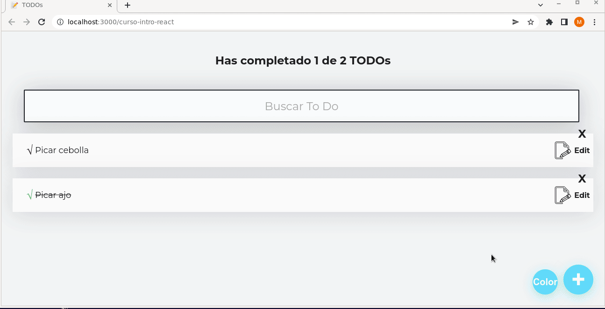
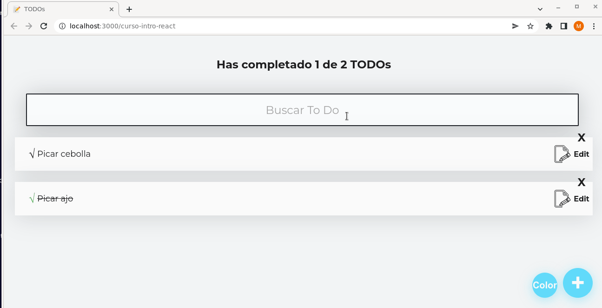
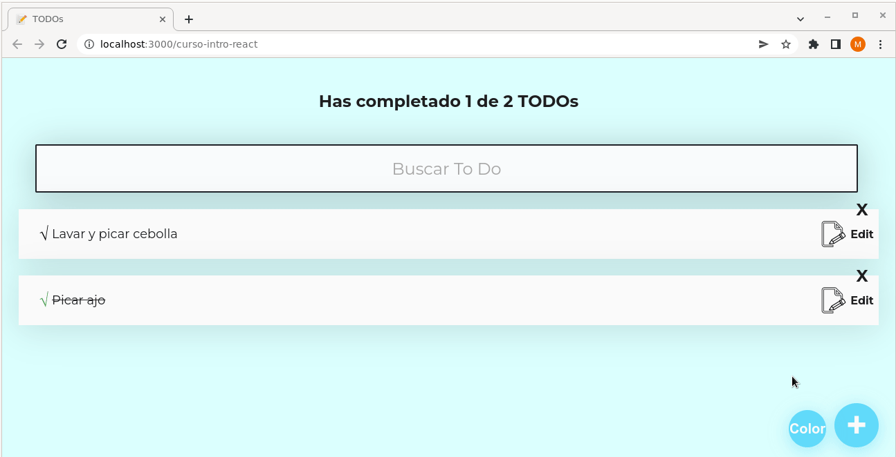
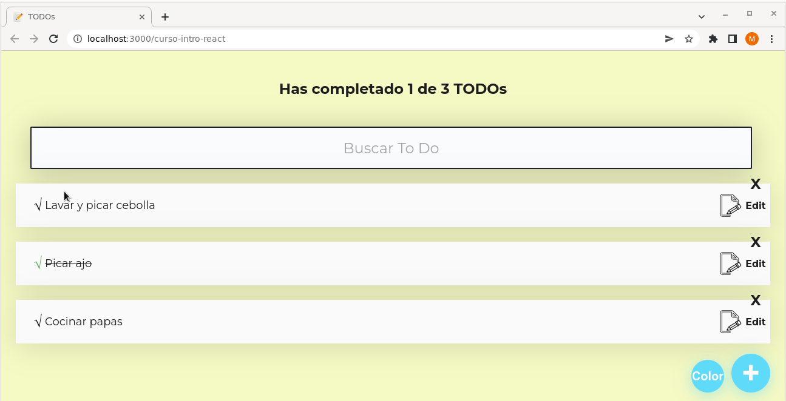
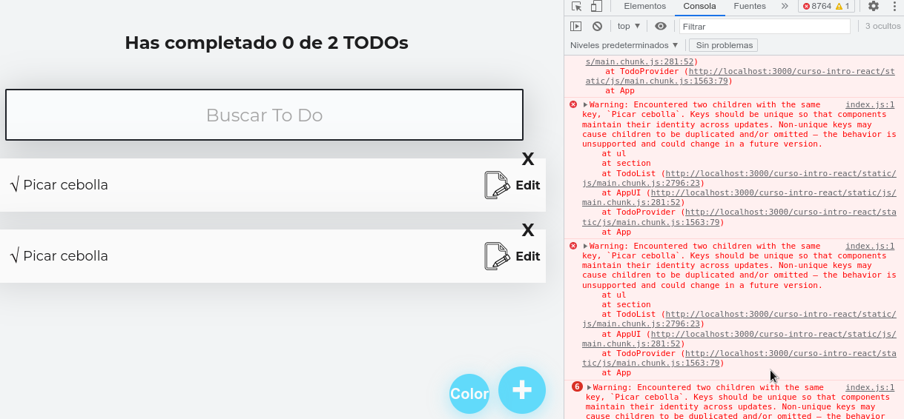
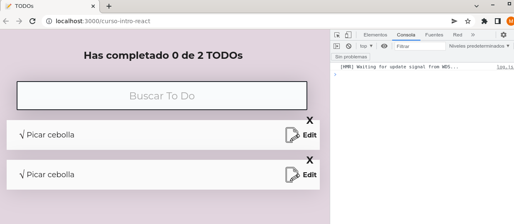

# crud-REACT-localStore

### A continuación se presentan los cambios y/o mejoras realizadas al proyecto original:

#### 1) Se agrega botón que abre paleta de colores, permitiendo seleccionar un color a gusto del usuario que será aplicado al fondo de la página, como se muestra a continuación:

#### 2) Se agrega botón que permite editar las tareas ya adicionadas a la lista TODOs:

#### 3) Se adiciona restricción para que al momento de agregar una nueva tarea o hacer alguna modificación, si el campo de entrada de datos está vacío, no permite guardar.
##### Nota: Esta condición aplica para editar o agregar nueva tarea y para cambiar color.

#### 4) Se agrega opción que  permite deseleccionar una tarea marcada como hecha.
##### Nota: Se puede dar el caso que el usuario marque por error una tarea pendiente como hecha.

#### 5) Se soluciona Warning que se presenta al ingresar dos actividades iguales, como se muestra en la siguiente imagen. Esta situación se da debido a que se tiene una “key” repetida para las actividades agregadas (key={todo.text}), y react necesita una “key” individual, para poder diferenciar los componentes repetidos.

#### Solución: se agreaga una "key" que no se repite para cada actividad.

